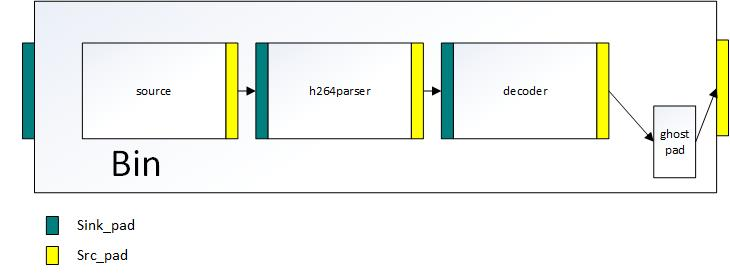

# Bin Element trong Gstreamer
- Các bạn có thể đọc tài liệu về bin của Gstreamer [ở đây](https://gstreamer.freedesktop.org/documentation/application-development/basics/bins.html?gi-language=c)
- Bin là một kiểu Element trong Gstreamer cho phép lập trình viên có thể đóng gói rất nhiều element lại với nhau để thực hiện một mục đích nào đó. Hiểu nôm na nó giống như class trong ngôn ngữ lập trình, sử dụng các kiểu dữ liệu có sẵn để định nghĩa một đối tượng mới...  
-  Trong ví dụ [deepstream_test1](https://github.com/tienln4/deepstream_from_scratch/blob/main/doc/deepstream_test1.md) chúng ta thấy để đọc được file *.h264 chúng ta cần các element từ Gstreamer: source, h264parserdecoder. Giờ thì chúng ta có thể gộp 3 element này lại và cho vào `bin`, 
- Về bản chất `Bin` nó cũng là 1 element nên sẽ có tất cả các thuộc tính của element, chỉ khác là nó chứa được thằng khác

# Ví dụ về ứng dụng của Bin element
- Quay lại với ví dự [deepstream_test1](https://github.com/tienln4/deepstream_from_scratch/blob/main/doc/deepstream_test1.md), chúng ta sẽ thực hiện đóng gói các element để đọc file thành một bin mới
- Dòng 183: Cú pháp tạo 1 bin  
- Dòng 190: Add tất cả các element liên quan đến đọc và xử lý file vào trong bin
- 191 - 194: Link các element trong bin với nhau
- ghost_pad: Phần quan trọng nhất khi sử dụng bin
    - Đọc thêm tài liệu [tại đây](https://gstreamer.freedesktop.org/documentation/additional/design/gstghostpad.html?gi-language=c)
    - Như đã đề cập những phần trước, các element giao tiếp với nhau thông qua pad của nó, trong trường hợp này: soure không cần giao tiếp với bên ngoài (bản thân nó chỉ có src mà không có sink). Do đó chỉ duy nhất decoder cần truyền dữ liệu ra khỏi bin.
    - ghost_pad: là một cầu nối của `element pad` trong `bin` và `bin pad`, cụ thể chúng ta cần liên kết `src_pad` của `decoder` với `ghost_pad` và `ghost_pad` với `src_pad` của `bin`. Giải thích hơi khó hiểu, các bạn nhìn hình vẽ nhé :)))

