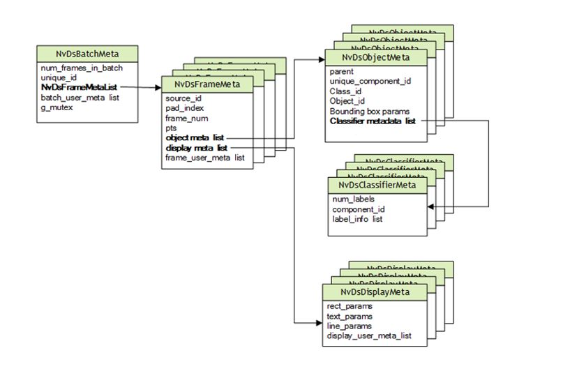

# Metadata Deepstream
- Deepstream hoạt động theo pipeline là sự kết hợp của nhiểu Gstreamer elements, các element này giao tiếp, trao đổi thông tin với nhau thông qua metadata
- Bản chất metada của deepstream chứa các thông tin như: Kích thước ảnh, địa chỉ vùng nhớ ảnh trên GPU, thông tin về source, thông tin về kết quả inference... Tóm lại nó chứa rất nhiều thông tin về một chương trình của detection, classification...
- Thư viện deepstream cho phép nhà phát triển làm việc trực tiếp với metadata (Hoặc can thiệp vào xử lý data trên GPU và việc này cần build lại thư viện deepstream (Hơi khoai))  

# Phân tích metadata của deepstream 

- Cấu trúc metadata của deepstream được chia làm các bậc, tùy thuộc tại vị trí nào trong pipeline của deepstream mà các thông tin này được tạo ra
    - NvDsBatchMeta (1)
    - NvDsFrameMeta (2)
    - NvDsObjectMeta, NvDsDisplayMeta (3)
    - NvDsClassifierMeta (4)

# Duyệt metadata trong deepstream
- Trong phần [trước](https://github.com/tienln4/deepstream_from_scratch/blob/main/doc/deepstream_test1.md) mình đã đề cập đến việc tạo `pad` để sử dụng hàm call_back xử lý metadata, trong ví dụ này mình sẽ phân tích sử dụng meta data trên [ví dụ này](https://github.com/tienln4/deepstream_from_scratch/blob/main/src/deepstream_test1/deepstream_test1.cpp)
- Dòng 24: Lấy batch_meta (thuộc bậc thứ 1) từ buffer
- Trong bach_meta chưa `frame_meta_list` gồm nhiều `frame_meta`
- Dòng 26 - 28: Duyệt các `frame_meta` (thuộc bậc thứ 2) trong `frame_meta_list`
- Trong mỗi frame meta chứa các obj_meta (data của detection...)
- Chú ý: nếu có 2 model detection nối tiếp nhau (Ví dụ: human detection, face detection detect trên kết quả của human detection) thì metadata thu được sau face detection là một rổ các obj_meta, để phân biệt các obj_meta, deepstream có các thuộc tính: `class_id` chỉ class_id của obj_meta đó, `unique_component_id` chỉ obj_meta đó được sinh ra ở đâu
- Đối với `NvDsDisplayMeta`: chỉ các thông số cho việc visualize như màu sắc của bbox, text...
- `NvDsClassifierMeta`: Chứa các thông tin về classiffication (recognition) sẽ được nói rõ ở phần ứng dụng của nó