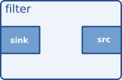

Hai thành phần quan trọng trong Deepstream là Tensorrt và Gstreamer plug in  
Trong phần này mình sẽ giới thiệu một số thành phần cơ bản của Gstreamer và cách dùng. Đọc thêm tài liệu của Gstreamer [tại đây](https://gstreamer.freedesktop.org/documentation/tutorials/index.html?gi-language=c)

# TensorRT
- TensorRT là bộ công cụ phát triển phần mềm (SDK) học sâu (deep learning) do Nvidia phát triển. Nó cho phép các ứng dụng hoạt động nhanh hơn so với training model (Pytorch, Caffe, ...)
- Để convert training model sang inference model (Tensorrt) tham khảo [tại đây](LinkToTensorrt)

# Gstreamer plugin

- GStreamer là một pipeline-based multimedia framework (Nền tảng xử lý đa phương tiện dựa trên đường ống). 
- GStreamer's development framework giúp bạn có thể viết bất kỳ loại ứng dụng đa phương tiện truyền trực tuyến nào với việc tối ưu xử lý dữ liệu
- Một số ví dụ về sử dụng Gstreamer viết bằng C, tham khảo [tại đây](https://gstreamer.freedesktop.org/documentation/tutorials/basic/hello-world.html?gi-language=c)
- Gstreamer hoạt động bằng cách ghép nối một số Element nhất định với nhau để thực hiện một ứng dụng nào đó, với mỗi Element sẽ đảm nhiệm một chức năng xử lý dữ liệu. Trong phần này mình sẽ giới thiệu một số Element quan trọng để xây dựng một pineline đọc ảnh từ máy tính đơn giản

## Element
- Là đối tượng quan trọng nhất trong GStreamer. Element là khối xây dựng cơ bản cho một đường ống (pineline).  
- Với việc lập trình ứng dụng thì Element được xem như một hộp đen, đặt một thứ gì đó ở đầu vào và nhận một thứ khác xuất hiện ở đầu ra. Điều cần làm là hiểu rõ chức năng của các Element và ghép các Element lại với nhau để thực hiện một mục đích nào đó
- Cấu tạo của một element  



- sink (sink of element): nhận dữ liệu từ Element trước đó (Nơi để hứng dữ liệu)  
- src (src of element): Chứa dữ liệu của Element đó sau khi được xử lý  
- Ngoại trừ một số Element đặc biệt thì các Element đều có sink và src của nó  
- đối với ``source element`` chỉ có src mà không có sink. ngược lại, với ``sink element`` chỉ có sink mà không có src   
- Trong hình là một filter element có sink (bên tay trái) và src (bên tay phải)

Để tạo một Element  
```
GstElement * element;
element = gst_element_factory_create ("filter", "fiter_name");
```

- Các Element liên kết với nhau thông qua Pad (Pad cũng là một object của gstreamer)  
- Tương tự, với mỗi Element có sink_pad (bên tay trái) và src_pad (bên tay phải)  
  
Liên kết các Element với nhau
- Hầu hết các element đều có thể liên kết với nhau thông qua câu lệnh (ngoại trừ một số Element như streamuxer)  

```
gst_element_link_many (source, filter, sink, NULL) 
//or
gst_element_link(source, filter)
```
## Bins
- Bin là một thùng chứa (container) các element, có thể đóng gói nhiều element vào một Bin để thực hiện một chức năng nhất định. Về bản chất Bin cũng chính là một Element nên nó có tất cả những xử lý của một element. 


Tạo Bin chứa 3 element
```
bin = gst_bin_new ("bin_example");
element_1 =  gst_element_factory_make ("fakesrc", "source");
element_2 = gst_element_factory_make ("fakesink", "sink");
element_3 = gst_element_factory_make ("fakesink", "sink");

gst_bin_add_many (GST_BIN (bin_example), element_1, element_2, element_3, NULL);
gst_element_link_many (element_1, element_2, element_3, NULL);
```

## Pads
- Như đã nói phần trên, Element có các pad được xem là interface với các thành phần bên ngoài. Dữ liệu từ element's source pad đến element's sink pad khác  
- Sử dụng Pad như thế nào sẽ được giải thích trong những ví dự sau